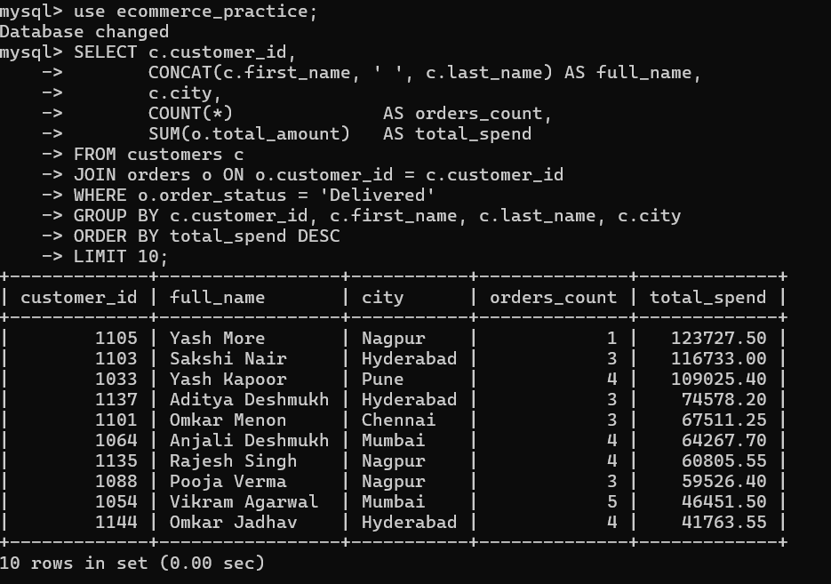
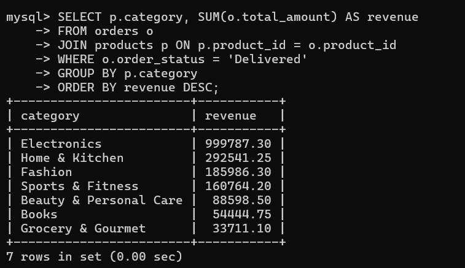
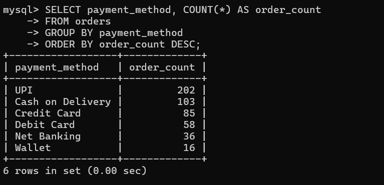
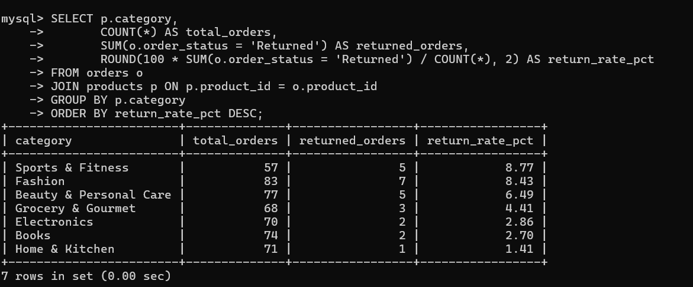
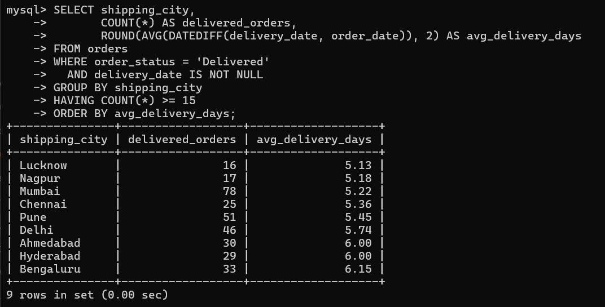
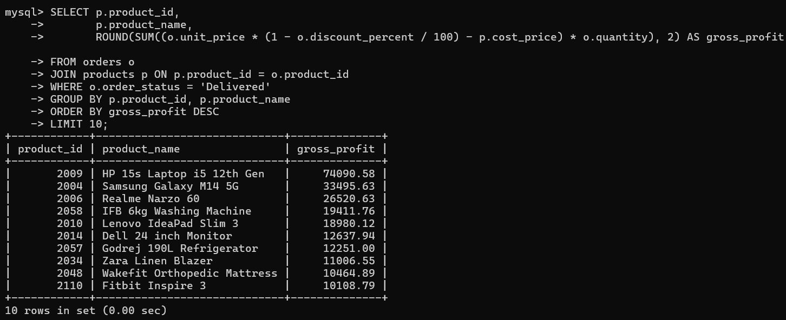
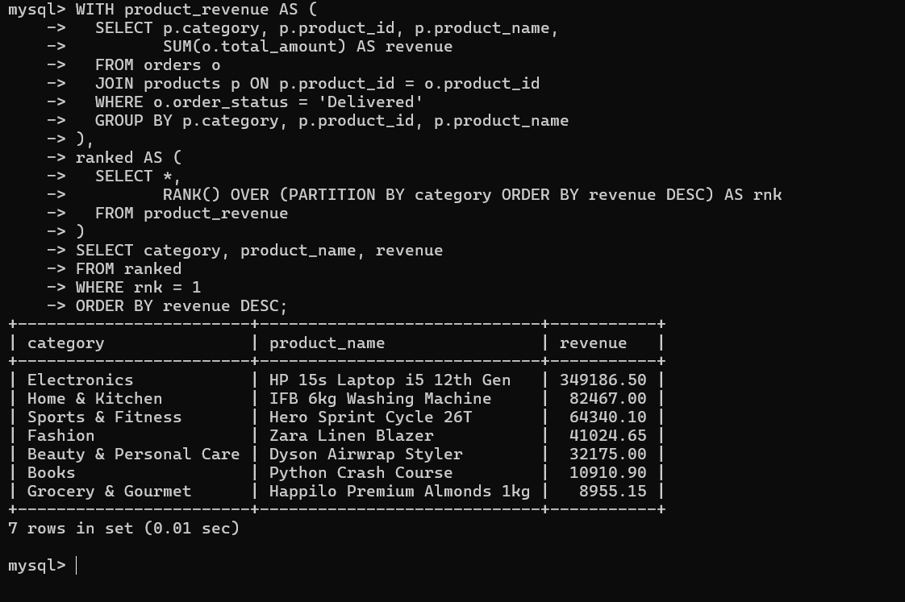

# E-Commerce Business Analysis using SQL

A SQL analysis project based on an e-commerce dataset containing customers, products and orders.

## Objective

Use SQL to answer practical business questions related to customers, products, sales, returns and operations.

## Dataset

- 150 customers
- 130 products
- 500 orders
  

For revenue analysis, only **Delivered** orders are treated as revenue, using `total_amount`.

## Business Areas

- Customer Analysis
- Product Analysis
- Sales & Orders
- Returns & Operations
-Business Insights

## SQL Concepts Used

- SELECT, WHERE, ORDER BY
- GROUP BY and HAVING
- Aggregate functions
- JOINs 
- CTEs
- Window function: `RANK()`

## Project Structure

```text
ecommerce-sql-business-analysis/
├── README.md
├── dataset/
│   └── README.md
├── results/
│   ├── README.md
│   ├── 01_top_customers_by_spend.png
│   ├── 02_revenue_by_category.png
│   ├── 03_payment_method_usage.png
│   ├── 04_return_rate_by_category.png
│   ├── 05_average_delivery_time_by_city.png
│   ├── 06_top_products_by_gross_profit.png
│   └── 07_best_selling_product_by_category.png
└── sql/
    ├── 01_customer_analysis.sql
    ├── 02_product_analysis.sql
    ├── 03_sales_and_orders.sql
    ├── 04_returns_and_operations.sql
    └── 05_business_insights.sql
```


The project focuses on selected business problems rather than uploading the complete practice question set.

## Selected Results

The project includes selected MySQL query outputs as visual result files.

### 1. Top 10 Customers by Total Spend


### 2. Revenue by Product Category


### 3. Most-Used Payment Method


### 4. Return Rate by Product Category


### 5. Average Delivery Time by Shipping City


### 6. Top 10 Products by Gross Profit


### 7. Best-Selling Product by Revenue in Each Category


## Key Observations

1)Electronics generated the highest revenue among the product categories.
2)UPI was the most-used payment method with 202 orders.
3)Sports & Fitness had the highest return rate at 8.77%.
4)Lucknow had the lowest average delivery time among cities meeting the 15-order threshold, at 5.13 days.
5)HP 15s Laptop i5 12th Gen had the highest gross profit among the products shown.
6)HP 15s Laptop i5 12th Gen was also the highest-revenue product in the Electronics category.
